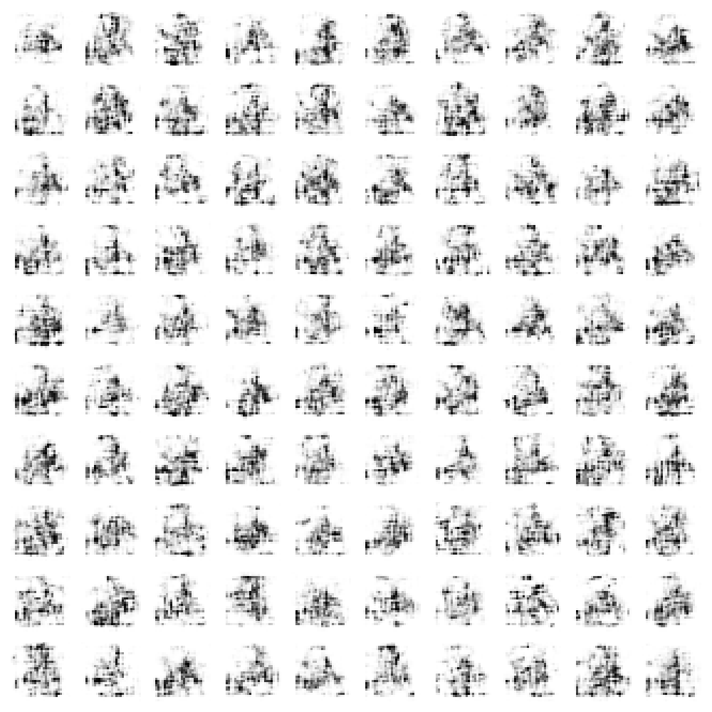
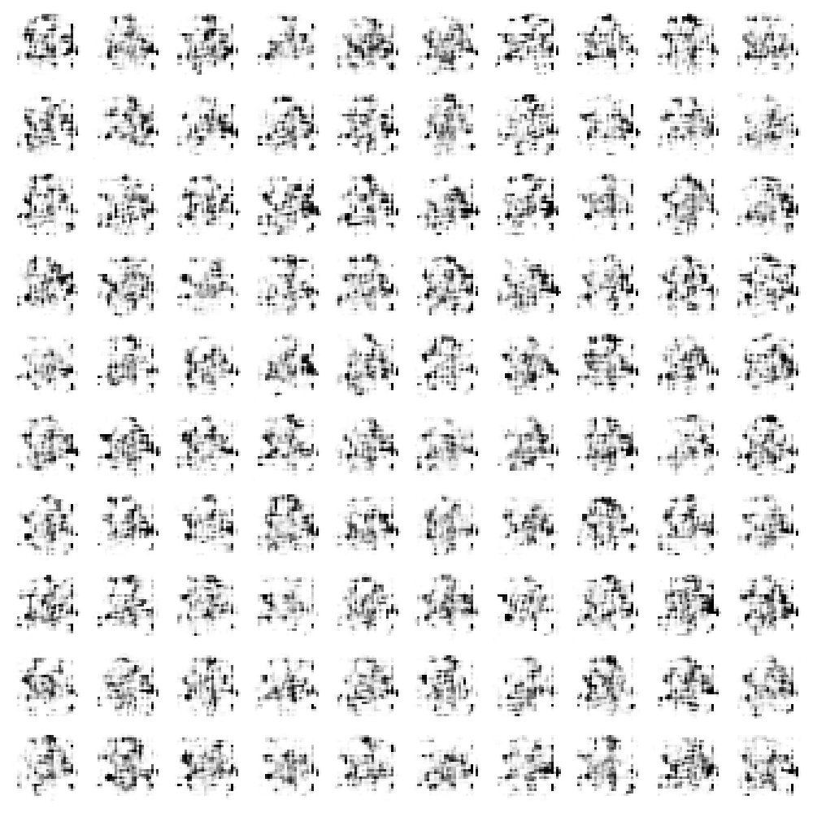
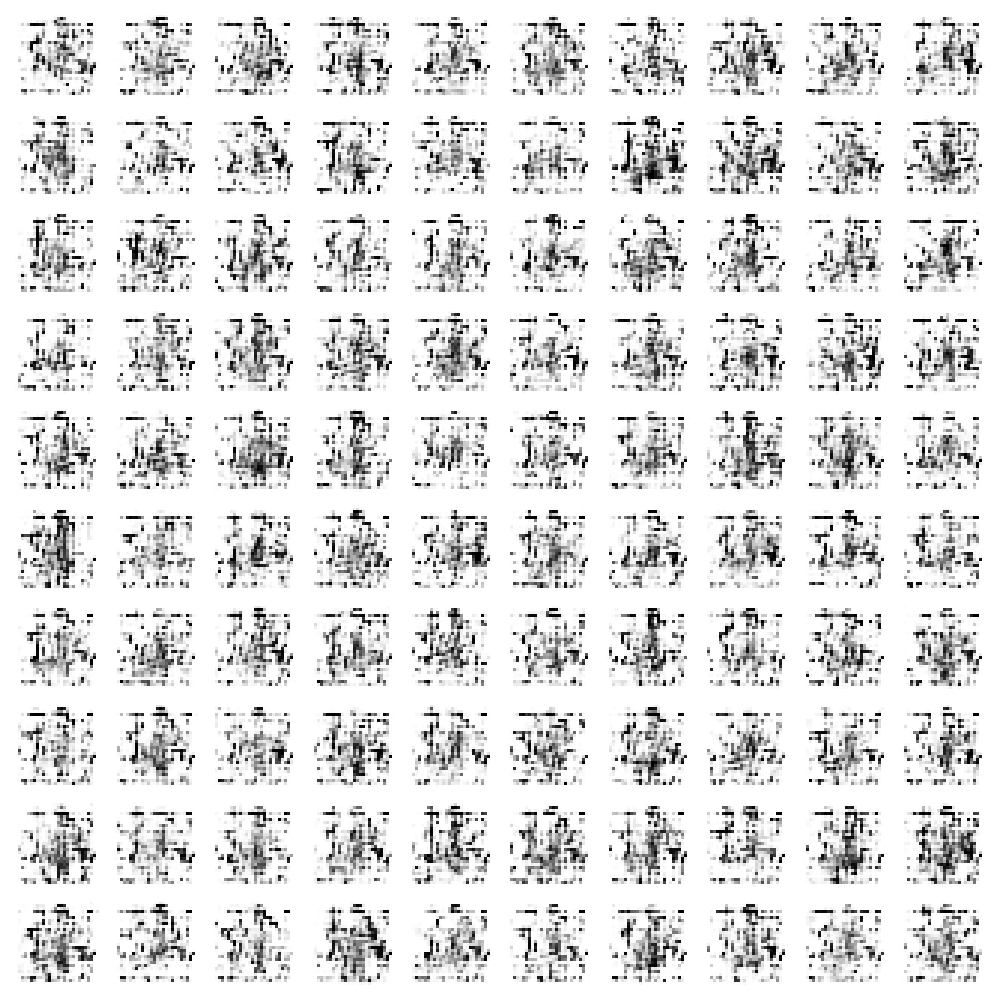
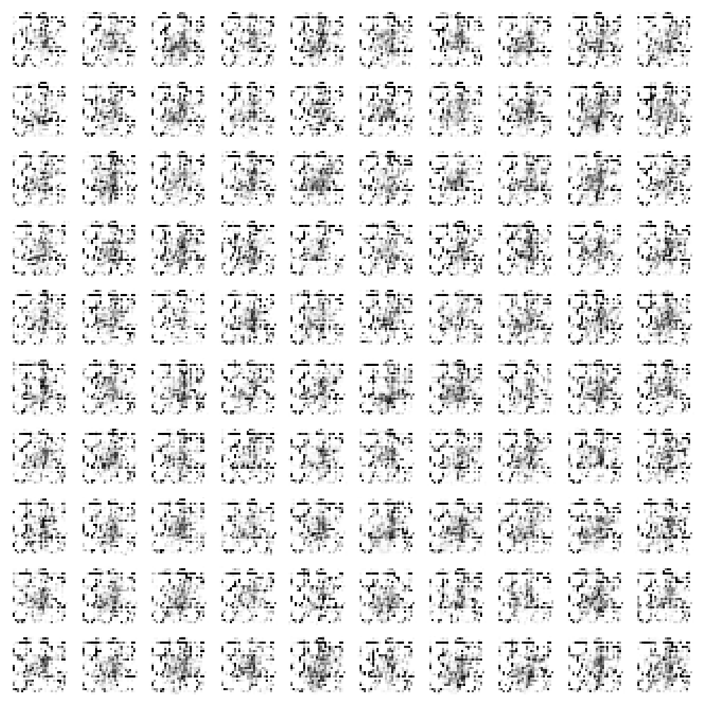

# Fashion MNIST Generative Adversarial Network

This project is a simple implementation of a Generative Adversarial Network (GAN) using the Fashion MNIST dataset. The
GAN is implemented using Tensorflow and trained on the Fashion MNIST dataset. The GAN is trained to generate new images
of clothing items that are similar to the images in the Fashion MNIST dataset.

## Installation

The requirements of the project are listed in the `requirements.txt` file. To install the requirements, run the
following command:

1. Create a virtual environment and activate it:

```bash
python -m venv venv
source venv/bin/activate
```

2. Install the requirements:

```bash
pip install -r requirements.txt
```

## Usage

All the code for the project is in the `main.ipynb` notebook. Architectures of the generator and discriminator are
located in separate directories called `generator` and `discriminator` respectively. Code for training the GAN is
in the notebook.

## Results

The GAN was trained for 10000 epochs on the Fashion MNIST dataset with 32 batch size. The results of the training are:

- After 500 epochs



- After 1000 epochs



- After 5000 epochs



- After 9500 epochs

